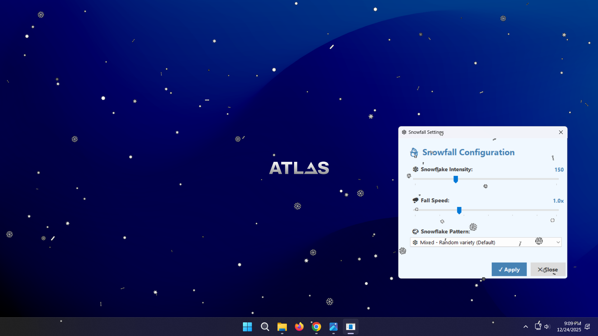

# ❄️ Snowfall Desktop Application

**A beautiful snowfall overlay for Windows with realistic physics and 7 different snowflake patterns!**

[📥 Download Latest Release](../../releases/latest) • [🐛 Report Bug](../../issues) • [⭐ Star this repo](../../stargazers)

---

## ✨ Features

### 🎨 **7 Different Snowflake Types**
- **Mixed** - Random variety (Default)
- **Classic** - Traditional 6-branch crystal
- **Stellar** - Star-like with detailed branches
- **Dendrite** - Tree-like dendritic branches
- **Plate** - Flat hexagonal plate
- **Column** - Column-like crystal
- **Needle** - Thin needle-like
- **Minimal** - Small elegant dots

### 💎 **Realistic Physics**
- Natural swing motion
- Continuous rotation
- Parallax effect (larger flakes fall faster)
- Variable opacity for depth

### 🖥️ **Complete GUI**
- **System Tray Icon** - Control from notification area
- **Settings Window** - Modern interface for configuration
- **Beautiful Design** - Clean winter-themed UI

### ⚡ **Optimized Performance**
- 60 FPS smooth animation
- Double buffering
- Click-through transparent overlay
- Multi-monitor support
- Minimal CPU usage (<5%)

## 📸 Preview

